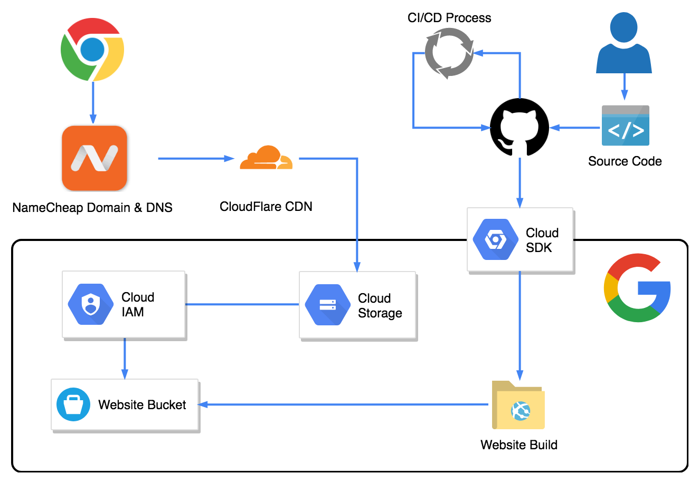
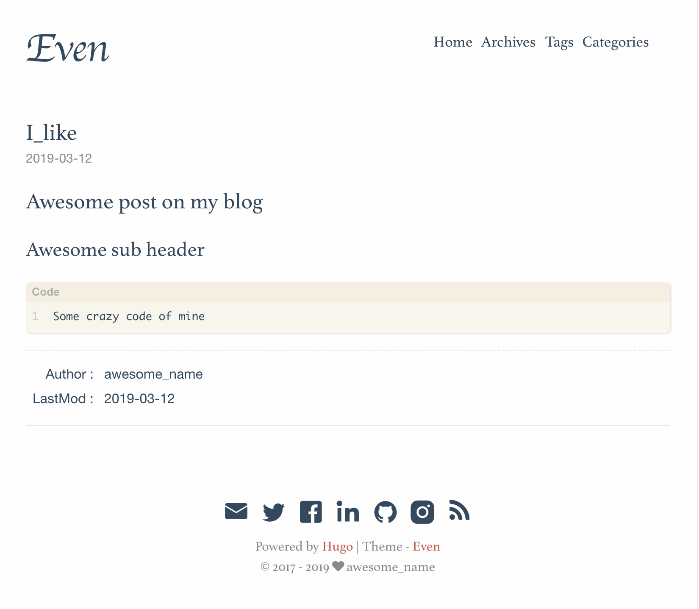
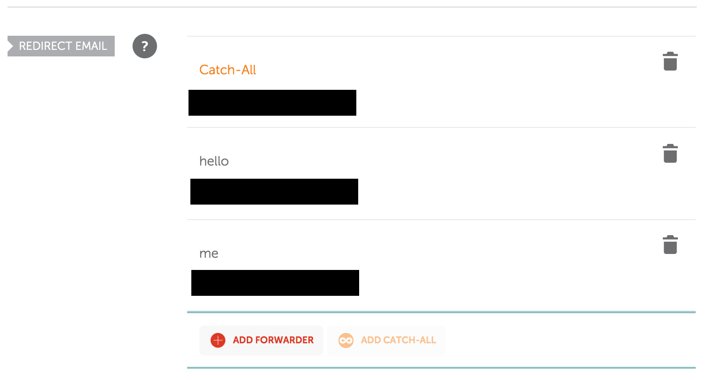
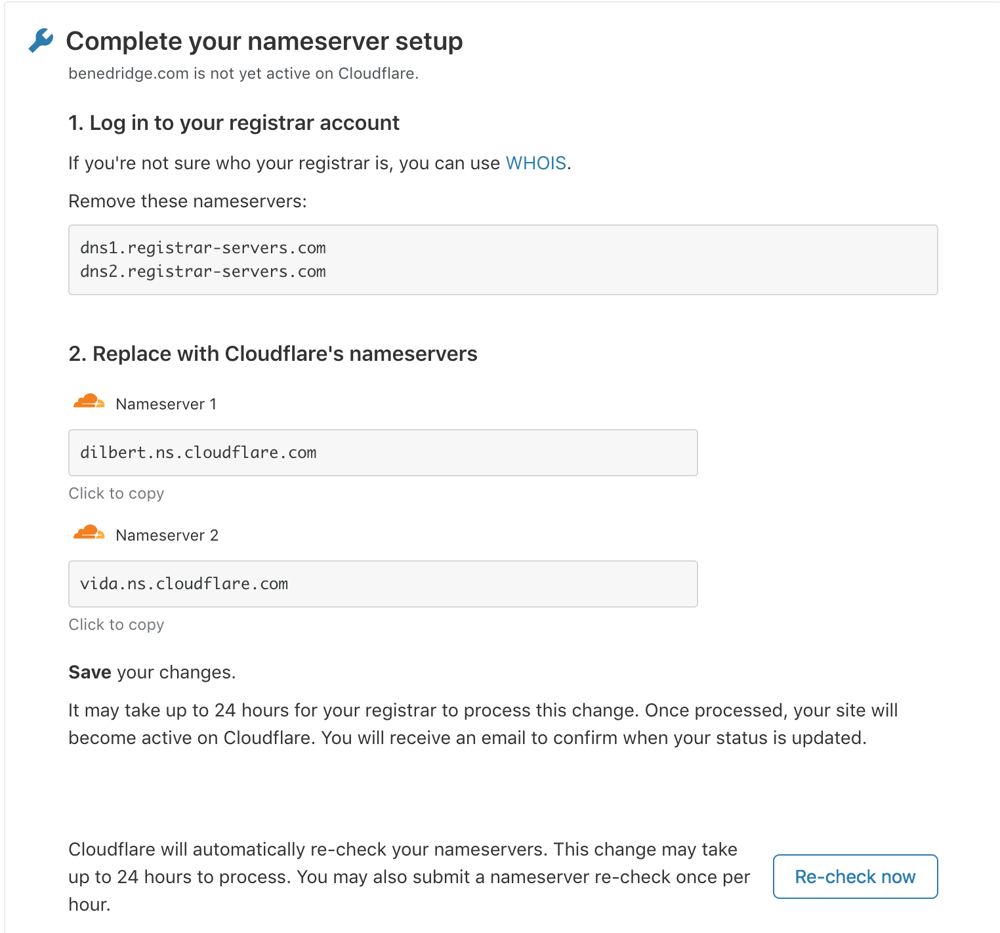

# Building a Website for Production on the Cloud ☁️



# Introduction

## Why?

This workshop will guide you through a full production Cloud Deployment of your own personal blog including domain registration, configuration, deployment options, HTTPS, performance and standard development practices.

>There are only two hard things in Computer Science: cache invalidation and naming things.
>
>-- Phil Karlton

Maybe we will get a little understanding to what cache invalidation is after we configure out Cloudflare.com CDN!

## What are we building?



We will be generating our static website with `hugo` this is a template and is fully extensible or can be swapped out entirely for another generator and just plain old HTML, CSS and JavaScript.

- Hugo gives us an easy way to write templates in markdown, style them then generate posts/pages via Markdown formatting. Markdown is a **Markup** authoring syntax to author text files. This file is written in github.com flavour of Markdown

We will then make use of a domain provider `namecheap` in this case to point to a cached version of your website on the Cloudflare Content Delivery Network (This will result in global distribution of your website and great load times!). All of the code is hosted on Google Cloud Platform, utilising a GitHub Continuous Integration/Developer process that pushes code through the Google Cloud SDK and Uploads the resulting build files into a Google Cloud Storage Bucket automatically. 

- This new paradigm of building static websites with a generator is called a `JAM` Stack and is a relatively new concept.
- The JAM stack gives us flexibility, open APIs and decoupling between content authoring and deployment.

## 📚 Resources
https://jamstack.wtf/  
https://www.staticgen.com/  
https://headlesscms.org/

# Prerequisites 
Complete this before the workshop if you can, it will save time! Some of these instructions may differ depending on operating system!

- Make sure you have a Credit/Debit Card you can use for Google Cloud sign up
- Registrations:
  - [NameCheap](namecheap.com) Domain provider or a free [.me](https://nc.me) domain!
  - [Cloudflare](cloudflare.com) CDN & Extra DNS provider
  - [Google Cloud Platform](https://console.cloud.google.com/freetrial) (Credit/Debit card required)
    - Make sure you enable billing and add your card
  - [GitHub](github.com) (Hosting & building your website content)
- Download and install:
  - [Hugo](https://gohugo.io/getting-started/installing) a static site generator with markdown templating 
  - [NodeJS](https://nodejs.org/en/download/)
  - [Google Cloud SDK including `gcloud`](https://cloud.google.com/sdk/install)
  - [Git](https://git-scm.com/downloads) (To manage github.com repositories and track code)

# Contents
- [Creating our Website Content](#💻-Creating-our-Website-Content)
- [Google Cloud Platform - Cloud Hosting Provider](#☁️-Google-Cloud-Platform-Cloud-Hosting-Provider)
- [Domain Setup and DNS config](#🌎-Domain-Setup-and-DNS-config)
- [Email Setup](#✉️-Email-Setup)
- [Cloudflare - Content Delivery Network (CDN)](#⚡-Cloudflare-Content-Delivery-Network-(CDN))
- [Automatic Deployment Continued](#Automatic-Deployment-Continued)
- [Extensions](#Extensions)

# 💻 Creating our Website Content

## Why do we want a static website?
- A static website is primarily HTML, CSS and JS and is usually fully interactive on the client side
- This may include routing, local state, animation and all manner of other cool things!
- However, we do not store state to databases, manage sessions or authorisations
- Sometimes the line is blurred between static and dynamic with new models of Serverless and other third party libraries

### To host and run a website we have a number of options:
- Run a server ourselves (A bit vintage but fun!)
- Upload your website content to another server managed elsewhere
- Use a fully managed solution such as Wordpress
- Use a static hosting solution (No server side scripting or code!)

This workshop focus is less on programming aspects of website creation but architectural decision making and understanding how to piece everything together! This is applicable not only to website design but many other areas.

## Getting started
Based on: https://gohugo.io/getting-started/quick-start/

Once you have the `hugo` static site generator up and running you should run through the quick start.

1. In a new directory create a new hugo website: `hugo new site my-blog` this will create a new directory for your hugo project
2. Find a theme you like! Currently we are using [hugo-theme-even](https://github.com/olOwOlo/hugo-theme-even) if you don't like this you can find another but it may require a different setup!
3. To add a theme we will be using: `git clone https://github.com/olOwOlo/hugo-theme-even my-blog/themes/even`
4. Copy over the config from our theme `cp themes/even/exampleSite/config.toml  config.toml`
5. Create a new blog post page `hugo new post/i_like_static_sites.md`
6. Edit your post eg `code content/post/i_like_static_sites.md`
7. Inside your web directory run `hugo server -D` Your server will now be running check it out at: http://localhost:1313
8. Make some changes to your post and watch the changes (it should have hot reloading!)
9.  Create a new blog post and pages relevant to your wishes or skip if you wish to get into the nitty gritty deployment
10. Run `hugo` to build all your assets including files marked as drafts
11. check the `public` directory to see you all the asset files/folder created from our previous command
12. Files in `public` are now the self contained build and will be served from Google Cloud Storage in the next steps.

**Be careful you may need configure the base url correctly in the `config.toml` file**
- If you are serving from example.com you will need to add this into the `config.toml` file.

# ☁️ Google Cloud Platform - Cloud Hosting Provider


## Basics

There are numerous ways to setup and host our website. For this workshop Google Cloud Platform is an ideal choice due to the ease of use and free credit/trial period provided. **Google Cloud Storage** is Google's offering for "bucket" storage (many cloud offerings have a similar service) this is simply a blob file storage with a number of other features including metadata, permissions and redundancy. 
  
To upload to GCS we can use `gcloud` tool or the web interface. `gcloud` is a command line interface allowing us submit a number of powerful commands to GCP and manage infrastructure.

## It's GCP time
1. To get started, you should login to the [Google Cloud Console](https://console.cloud.google.com/) with your Google account.
2. Make sure enable billing and your credit/debit card is added otherwise you can't create a project!
3. **Optional:** Set billing alerts for something like $10 so you don't waste the credit.
4. Create a new project for example: `my-new-blog`
5. Create a bucket under storage with a name like: `blog-website`
6. Create another bucket under storage with your domain if you have one `example.com`
7. Select `permissions` and update permissions to public this will allow anyone access to this bucket Add new permission for `allUsers` and give the role `Storage Object Viewer` this means anyone can access the content of the bucket. Be careful what you upload!
8. Makesure you have generated your website files using `hugo` then ipload all files in `public` directory to this bucket
9. Go back to bucket browser and find the public link to your file. It will be similar to: https://storage.googleapis.com/bucket-name/index.html where `bucket-name` is your bucket name chosen before.
10. Make sure everything is displayed correctly. You may need to change the config.toml file `baseURL` or you have incorrectly set your permissions on the bucket.

## Editing our config.toml

To deploy on a domain other than local we need to configure hugo via the `config.toml` file. Update the changes as below:

```
baseUrl = "https://<your domain>"  
title = "Choose an awesome title"
```

To submit your static files to GCP
```
gcloud /dist <bucket-name>

```

## Starting to get Automated

To start getting automated we should understand how to automatically build and deploy our website content.

1. To get started with automation make sure you have the `GCloud SDK` downloaded
2. Before running any `gcloud` tools you will need to login to the same Google account that you signed up to GCP with make sure you run: `gcloud auth login` this will open a browser window to login to Google.com
3. Make some changes to your basic website or add another blog post
4. Run `hugo` again to build everything into the output file
5. Once built run the GCloud SDK toolkit and use with your correct `local-dir` and correct `bucket-name` you created before
 ```
 gsutil rsync -R local-dir gs://bucket-name
 ```
`gsutil` is the Google Storage Utility and allows you to manage GCS this command will do a recursive sync of the local-dir to the GCS bucket.

Now navigate to your bucket again, have a look and see if you can access your site. It should be available at: gcs.googleapis.com/my-bucket/index.html

## 🔥 Extra:
- Keep exploring the GCP console
- Look at alternative static site generators
- Keep digging into `hugo`

# 🌎 Domain Setup and DNS config

Time to make use of that `.me` domain or another domain on namecheap.com. To get things up and running we need to use the Domain Name System (DNS) to point our domain to the endpoint in Google Cloud Platform.

1. Login to [Google Search Console](https://search.google.com/search-console/welcome) with the **same** account you used to Signup for Google Cloud Platform. Here you will need to add your new fancy domain to the console.
2. You will be presented with an option `Verify ownership via DNS record` copy that record for namecheap.com
3. Log back into namecheap.com and set up a new DNS record with the valid `TXT` record with the lowest `TTL` from the previous step to confirm your ownership of the domain.
4. Now go back to the search console and try to re-verify your ownership, it may take a little while but should verify!
5. Log back into Google Cloud Platform and try create a new bucket exactly the same as your domain eg. `yourdomain.com` if verification work we should be able to do this.
1.  Now we have verified our domain so we can go back to namecheap.com and put a `cname` entry in for `c.storage.googleapis.com` this will point to our storage on Google and the request to your domain will now route to Google Storage.
2.  Try it out, you may need to wait a little and also set the `TTL` to a small value to get quicker updates to your DNS propagation.

```
NAME                  TYPE     DATA
www.example.com       CNAME    c.storage.googleapis.com.
```

## 🔥 Extra:
- Explore some of the other DNS types, try creating a subdomain eg. blog.yourdomain.com

# ✉️ Email Setup

We now have our domain pointing to our website but what about emails. Don't you want to receive emails @ yourdomain.com?

We can go back to namecheap.com and enable `email forwarding` which will forward emails to our account used to signup to namecheap. We can set a `catch-all` or just have certain emails forward. Emails being sent won't be sent from this address but if you want to set that up as well check the extras section below.

1. Go to domain list
2. Manage
3. Email Forwarding

Set something up like the following:



Depending on whether you set a catch-all or not you should be able to send an email to the relevant address: eg. `<anything>@yourdomain.com`

## 🔥 Extra:
- Read into DMARC email validation with DNS
- Setup your own email forwarding/filtering on AWS using SES
- Setup free sender emailing service so you can send emails from your domain eg. Received from me@awesomedomain.com rather than forwarding to your gmail.com email.

# ⚡ Cloudflare - Content Delivery Network (CDN)

You have finished creating your website, it's up and running on our new domain but we want speed!

We did a test on [cdnplanet](https://www.cdnplanet.com/tools/cdnperfcheck) and our friends in the Philippines are getting slow response times 😢
To speed up content delivery we need to cache files closer to our end users. The server might be located in Australia but we can cache globally over a large network. A CDN will intelligently route traffic to those edge locations so users can reduce latency.

Make sure you modify the records in namecheap.com to match the required DNS settings by cloudflare.com

1. Login in to your cloudflare.com account
2. You will be prompted to enter in your domain you own
3. Once entered you will get a similar info page as below



4. Make sure you copy these values and log back into namecheap.com
5. Under the Name Server settings in the dashboard for your domain change these values and save
6. This may take quite a while to complete so you may only have you Cloudflare setup after you left this workshop
7. Sadly your email redirection we previously setup will fail with Cloudflare due the Nameservers being changed to Cloudflare rather than the Namecheap servers. Namecheap it's own Nameserver to populate the `MX` records for email forwarding

## 🔥 Extra:
- Cloudflare has a huge amount of options, explore all the tabs!

# Automatic Deployment Continued

We can make use of Github and TravisCI for our deployment toolkit. We will link TravisCI and online CI/CD tool to our repository in GitHub.

https://developer.github.com/webhooks/

## Github auto deployment

1. Fork this repository or create your own
2. First setup github.com hooks for when you make changes to your repository
3. A hook is basically a request made by github.com to an endpoint of your choice
4. Our endpoint will be a serverless function that reads in our github repository from the repo, runs hugo, builds and then pulls in the release updating our Google Cloud Storage

## GitLab auto

## 🔥 Extra:
- Look into open source CI/CD platforms eg. Travis CI
- gitlab.com provides some great features utilising containerisation
- Setup your own more complicated CI/CD pipeline in the Cloud and make use of that credit

# Extensions
- Dynamic content
  - 3rd party (form submissions, comment sections)
  - Serverless functions for dynamically creating pages or sending an email
- Extra subdomains and features eg. help.yourdomain.com
- Switching the static site hosting to Amazon Web Services
  
# Acknowledgements
https://github.com/olOwOlo/hugo-theme-even
